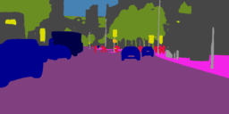
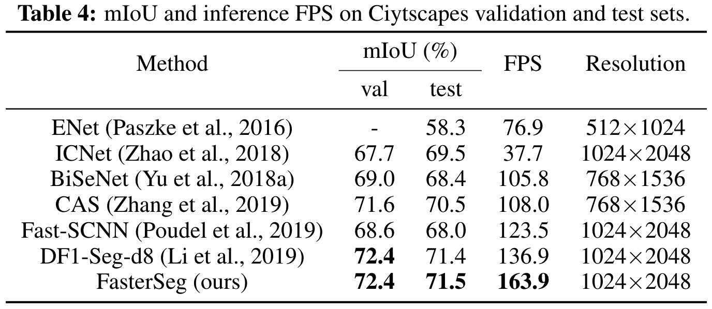
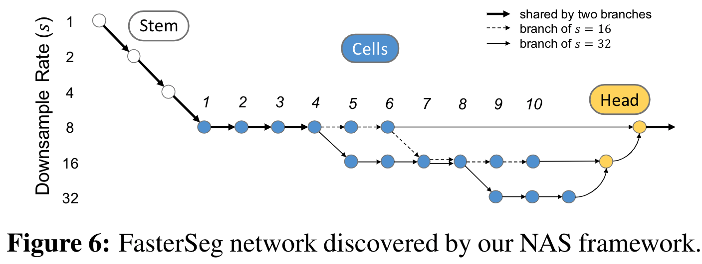

# FasterSeg: Searching for Faster Real-time Semantic Segmentation [[PDF](https://arxiv.org/pdf/1912.10917.pdf)]

[](https://lgtm.com/projects/g/TAMU-VITA/FasterSeg/context:python) [](https://opensource.org/licenses/MIT)

Wuyang Chen, Xinyu Gong, Xianming Liu, Qian Zhang, Yuan Li, Zhangyang Wang

In ICLR 2020.

## Overview

<figure align="center">
  </br>
  <figcaption>Our predictions on Cityscapes Stuttgart demo video #0</figcaption>
</figure>

We present FasterSeg, an automatically designed semantic segmentation network with not only state-of-the-art performance but also faster speed than current methods. 

Highlights:
* **Novel search space**: support multi-resolution branches.
* **Fine-grained latency regularization**: alleviate the "architecture collapse" problem.
* **Teacher-student co-searching**: distill the teacher to the student for further accuracy boost.
* **SOTA**: FasterSeg achieves extremely fast speed (over 30\% faster than the closest manually designed competitor on CityScapes) and maintains competitive accuracy.
    - see our Cityscapes submission [here](https://www.cityscapes-dataset.com/method-details/?submissionID=5674).

<p align="center">
</br>
</p>

## Methods

<p align="center">
</br>
</p>

<p align="center">
</br>
</p>

## Prerequisites
- Ubuntu
- Python 3
- NVIDIA GPU + CUDA CuDNN

This repository has been tested on GTX 1080Ti. Configurations (e.g batch size, image patch size) may need to be changed on different platforms.

## Installation
* Clone this repo:
```bash
git clone https://github.com/chenwydj/FasterSeg.git
cd FasterSeg
```
* Install dependencies:
```bash
pip install requirements.txt
```
* Install [PyCuda](https://wiki.tiker.net/PyCuda/Installation) which is a dependency of TensorRT.
* Install [TensorRT](https://github.com/NVIDIA/TensorRT) (v5.1.5.0): a library for high performance inference on NVIDIA GPUs with [Python API](https://docs.nvidia.com/deeplearning/sdk/tensorrt-api/index.html#python).

## Usage
* **Work flow: [pretrain the supernet](https://github.com/chenwydj/FasterSeg#11-pretrain-the-supernet) &rarr; [search the archtecture](https://github.com/chenwydj/FasterSeg#12-search-the-architecture) &rarr; [train the teacher](https://github.com/chenwydj/FasterSeg#21-train-the-teacher-network) &rarr; [train the student](https://github.com/chenwydj/FasterSeg#22-train-the-student-network-fasterseg).**
* You can monitor the whole process in the Tensorboard.

### 0. Prepare the dataset
* Download the [leftImg8bit_trainvaltest.zip](https://www.cityscapes-dataset.com/file-handling/?packageID=3) and [gtFine_trainvaltest.zip](https://www.cityscapes-dataset.com/file-handling/?packageID=1) from the Cityscapes.
* Prepare the annotations by using the [createTrainIdLabelImgs.py](https://github.com/mcordts/cityscapesScripts/blob/master/cityscapesscripts/preparation/createTrainIdLabelImgs.py).
* Put the [file of image list](tools/datasets/cityscapes/) into where you save the dataset.
* **Remember to properly set the `C.dataset_path` in the `config` files mentioned below.**

### 1. Search
```bash
cd search
```
#### 1.1 Pretrain the supernet
We first pretrain the supernet without updating the architecture parameter for 20 epochs.
* Set `C.pretrain = True` in `config_search.py`.
* Start the pretrain process:
```bash
CUDA_VISIBLE_DEVICES=0 python train_search.py
```
* The pretrained weight will be saved in a folder like ```FasterSeg/search/search-pretrain-256x512_F12.L16_batch3-20200101-012345```.

#### 1.2 Search the architecture
We start the architecture searching for 30 epochs.
* Set the name of your pretrained folder (see above) `C.pretrain = "search-pretrain-256x512_F12.L16_batch3-20200101-012345"` in `config_search.py`.
* Start the search process:
```bash
CUDA_VISIBLE_DEVICES=0 python train_search.py
```
* The searched architecture will be saved in a folder like ```FasterSeg/search/search-224x448_F12.L16_batch2-20200102-123456```.
* `arch_0` and `arch_1` contains architectures for teacher and student networks, respectively.

### 2. Train from scratch
* `cd FasterSeg/train`
* Copy the folder which contains the searched architecture into `FasterSeg/train/` or create a symlink via `ln -s ../search/search-224x448_F12.L16_batch2-20200102-123456 ./`
#### 2.1 Train the teacher network
* Set `C.mode = "teacher"` in `config_train.py`.
<!-- * uncomment the `## train teacher model only ##` section in `config_train.py` and comment the `## train student with KL distillation from teacher ##` section. -->
* Set the name of your searched folder (see above) `C.load_path = "search-224x448_F12.L16_batch2-20200102-123456"` in `config_train.py`. This folder contains `arch_0.pt` and `arch_1.pth` for teacher and student's architectures.
* Start the teacher's training process:
```bash
CUDA_VISIBLE_DEVICES=0 python train.py
```
* The trained teacher will be saved in a folder like `train-512x1024_teacher_batch12-20200103-234501`
#### 2.2 Train the student network (FasterSeg)
* Set `C.mode = "student"` in `config_train.py`.
<!-- * uncomment the `## train student with KL distillation from teacher ##` section in `config_train.py` and comment the `## train teacher model only ##` section. -->
* Set the name of your searched folder (see above) `C.load_path = "search-224x448_F12.L16_batch2-20200102-123456"` in `config_train.py`. This folder contains `arch_0.pt` and `arch_1.pth` for teacher and student's architectures.
* Set the name of your teacher's folder (see above) `C.teacher_path = "train-512x1024_teacher_batch12-20200103-234501"` in `config_train.py`. This folder contains the `weights0.pt` which is teacher's pretrained weights.
* Start the student's training process:
```bash
CUDA_VISIBLE_DEVICES=0 python train.py
```

### 3. Evaluation
Here we use our pretrained FasterSeg as an example for the evaluation.
```bash
cd train
```
* Set `C.is_eval = True` in `config_train.py`.
* Set the name of the searched folder as `C.load_path = "fasterseg"` in `config_train.py`.
* Download the pretrained weights of the [teacher](https://drive.google.com/file/d/168HtgNnY9OdCz5Z6FWxoJr-gd5EtS5Sp/view?usp=sharing) and [student](https://drive.google.com/file/d/1O56HnA0ug2M3K4SR3_AUzIs0wegy9BX6/view?usp=sharing) and put them into folder `train/fasterseg`.
<!-- * set the name of pretrained directory as `C.eval_path = "/path/to/pretrained/models/"` in `config_train.py`. -->
* Start the evaluation process:
```bash
CUDA_VISIBLE_DEVICES=0 python train.py
```
* You can switch the evaluation of teacher or student by changing `C.mode` in `config_train.py`.
<!-- * you will see the results like (will be also saved in the log file): -->

### 4. Test
We support generating prediction files (masks as images) during training.
* Set `C.is_test = True` in `config_train.py`.
* During the training process, the prediction files will be periodically saved in a folder like `train-512x1024_student_batch12-20200104-012345/test_1_#epoch`.
* Simply zip the prediction folder and submit to the [Cityscapes submission page](https://www.cityscapes-dataset.com/login/).

### 5. Latency

#### 5.0 Latency measurement tools
* If you have successfully installed [TensorRT](https://github.com/chenwydj/FasterSeg#installation), you will automatically use TensorRT for the following latency tests (see [function](https://github.com/chenwydj/FasterSeg/blob/master/tools/utils/darts_utils.py#L167) here).
* Otherwise you will be switched to use Pytorch for the latency tests  (see [function](https://github.com/chenwydj/FasterSeg/blob/master/tools/utils/darts_utils.py#L184) here).

#### 5.1 Measure the latency of the FasterSeg
* Run the script:
```bash
CUDA_VISIBLE_DEVICES=0 python run_latency.py
```

#### 5.2 Generate the latency lookup table:
* `cd FasterSeg/latency`
* Run the script:
```bash
CUDA_VISIBLE_DEVICES=0 python latency_lookup_table.py
```
which will generate an `.npy` file. Be careful not to overwrite the provided `latency_lookup_table.npy` in this repo.
* The `.npy` contains a python dictionary mapping from an operator to its latency (in ms) under specific conditions (input size, stride, channel number etc.)

## Citation
```
@inproceedings{chen2020fasterseg,
  title={FasterSeg: Searching for Faster Real-time Semantic Segmentation},
  authors={Chen, Wuyang and Gong, Xinyu and Liu, Xianming and Zhang, Qian and Li, Yuan and Wang, Zhangyang},
  booktitle={International Conference on Learning Representations},
  year={2020}
}
```

## Acknowledgement
* Segmentation training and evaluation code from [BiSeNet](https://github.com/ycszen/TorchSeg).
* Search method from the [DARTS](https://github.com/quark0/darts).
* slimmable_ops from the [Slimmable Networks](https://github.com/JiahuiYu/slimmable_networks).
* Segmentation metrics code from [PyTorch-Encoding](https://github.com/zhanghang1989/PyTorch-Encoding/blob/master/encoding/utils/metrics.py).